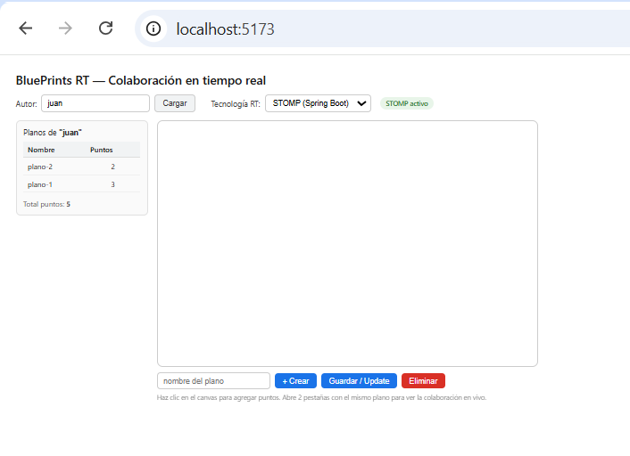
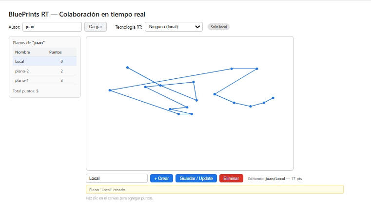
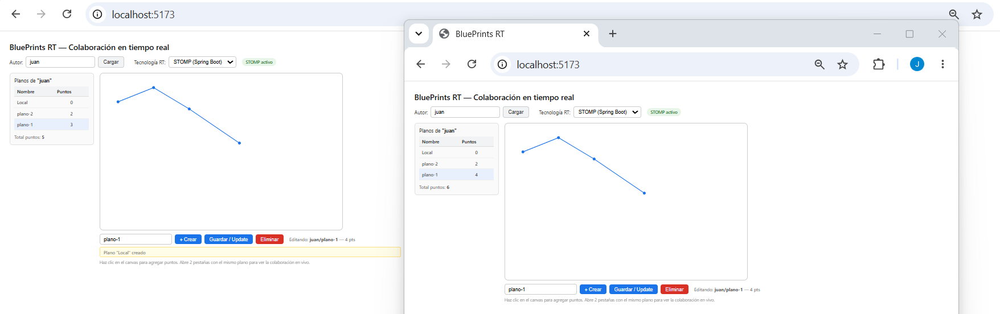
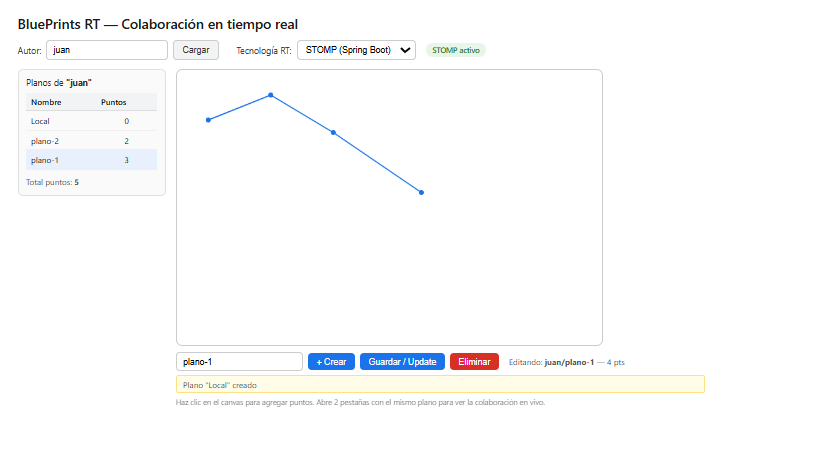
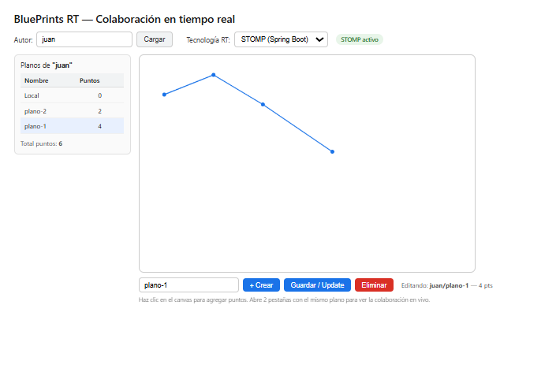
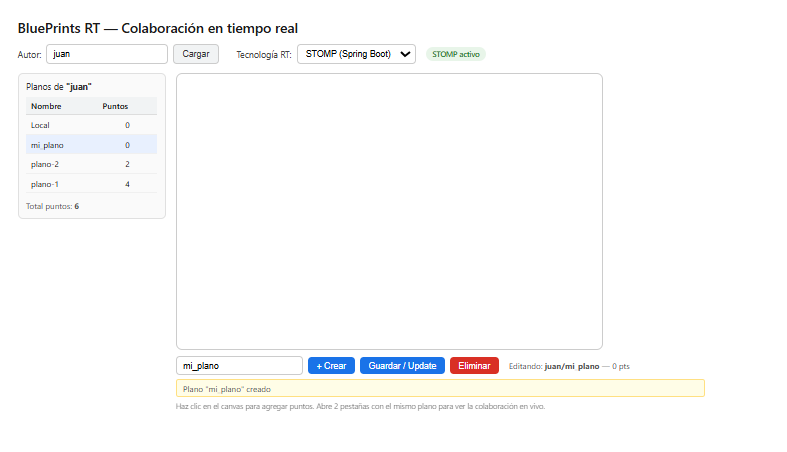
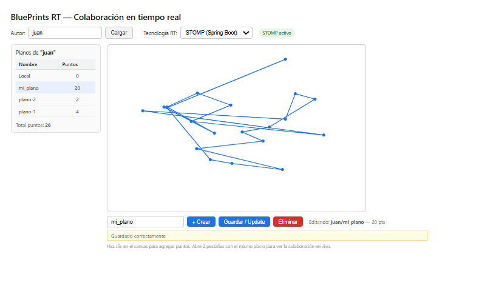
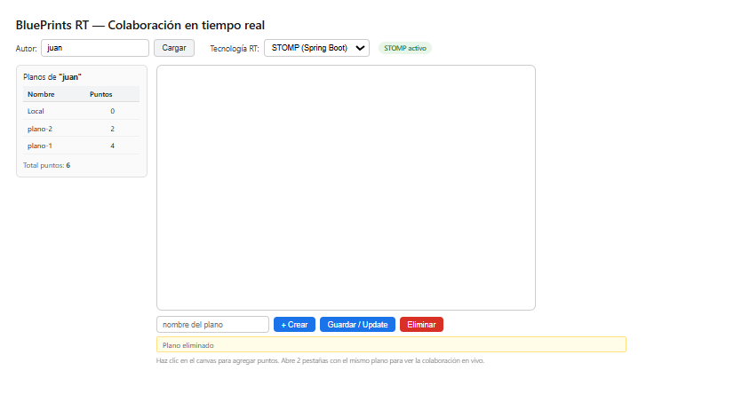

# BluePrints RT — Team README

> **Lab P5 · ARSW · Escuela Colombiana de Ingeniería**  
> Real-time collaboration on architectural blueprints using STOMP (Spring Boot + SockJS).

---

## Description

The project integrates a React frontend with a Spring Boot backend that exposes a full REST CRUD API for architectural blueprints and a WebSocket STOMP channel to propagate drawing points in real time to every client connected to the same blueprint. Each click on the canvas is sent to the server, which persists the point and broadcasts the updated blueprint to all subscribers on the corresponding topic in under 50 ms on a local network.

---

## Tech stack

The frontend uses React 18 with Vite 5, the `@stomp/stompjs` library for the STOMP protocol, and `sockjs-client` as the transport layer with automatic fallback. The backend is Spring Boot 3.3 with Spring WebSocket, serving both the REST API and the WebSocket from the same process on port 8080. Storage is in-memory using a thread-safe `ConcurrentHashMap`, sufficient for the scope of this lab.

---

## Project structure

```
Lab_P5_ARSW_RealTime/
├── backend/
│   └── src/main/java/edu/arsw/blueprints/
│       ├── config/       WebSocketConfig.java, WebConfig.java
│       ├── controller/   BlueprintController.java, BlueprintWebSocketController.java
│       ├── model/        Blueprint.java, Point.java, DrawMessage.java
│       ├── repository/   InMemoryBlueprintRepository.java
│       └── service/      BlueprintService.java
├── src/
│   ├── App.jsx
│   └── lib/
│       ├── stompClient.js
│       └── socketIoClient.js
├── screenshots/
└── .env.local
```

---

## Setup

**Backend** — run `cd backend` then `mvn spring-boot:run`. The server starts at `http://localhost:8080`.

**Frontend** — run `npm install` then `npm run dev`. The app opens at `http://localhost:5173`.

**Environment** — create `.env.local` at the project root with `VITE_API_BASE=http://localhost:8080`.

---

## REST endpoints used

`GET /api/blueprints?author={author}` returns all blueprints for an author including their points. `GET /api/blueprints/{author}/{name}` retrieves a single blueprint. `POST /api/blueprints` creates a new blueprint with an empty points list. `PUT /api/blueprints/{author}/{name}` replaces the blueprint's points with the array sent in the request body. `DELETE /api/blueprints/{author}/{name}` removes the blueprint from the repository.

The total point count per author is computed on the frontend using `reduce` over the list returned by the GET:

```js
const totalPoints = blueprints.reduce((acc, bp) => acc + (bp.points?.length ?? 0), 0)
```

---

## STOMP protocol

The backend registers the `/ws-blueprints` endpoint with SockJS as a fallback and uses `/app` as the prefix for incoming client messages and `/topic` for the broadcast broker. When the user clicks on the canvas, the frontend publishes to `/app/draw` an object containing the author, blueprint name, and point `{x, y}`. The `BlueprintWebSocketController` receives that message, adds the point to the repository, and uses `SimpMessagingTemplate` to broadcast the full updated blueprint to the topic `/topic/blueprints.{author}.{name}`. All subscribed clients receive the updated object and repaint the canvas.

The topic convention `blueprints.{author}.{name}` enforces per-blueprint isolation: events from `juan/plano-1` never reach clients of `juan/plano-2` or any other blueprint.

---

## STOMP vs Socket.IO

Both technologies achieve the same goal: propagating drawing events between clients in real time. The main difference lies in the level at which they operate and the infrastructure they require.

STOMP is a standard messaging protocol that runs on top of WebSocket. In Spring Boot it is natively integrated through `spring-boot-starter-websocket`, meaning the same process that serves the REST API also handles the WebSocket with no extra configuration. Channels are called topics and are defined with paths like `/topic/blueprints.juan.plano-1`. Any client that understands STOMP, regardless of language, can subscribe to them.

Socket.IO is a library with its own proprietary protocol that requires a separate Node.js server. Its "rooms" abstraction plays the same role as STOMP topics, but forces you to run two separate backends. It has the advantage of being simpler to set up in purely JavaScript projects where interoperability is not a concern.

For this lab, STOMP was the natural choice because the backend was already Spring Boot, the integration is native, and it adds no infrastructure complexity.

---

## Test cases and evidence

### Case 1 — Initial state: load blueprint from REST

With the backend running, the author `juan` is entered and **Load** is pressed. The call `GET /api/blueprints?author=juan` returns the pre-loaded blueprints and the table lists them with their point counts. Clicking on `plano-1` triggers `GET /api/blueprints/juan/plano-1` and the canvas draws the 3 stored points.



---

### Case 2 — Local drawing (no RT)

With the selector set to **None (local)**, each click on the canvas adds the point directly to the local state without going through the server. The point counter increases immediately. This mode is useful to verify that the canvas works independently of the RT connection.



---

### Case 3 — Real-time multi-tab collaboration

With two tabs open on the same blueprint and **STOMP (Spring Boot)** active, drawing in tab A causes the point to appear in tab B without reloading. The full flow is: click → publish `/app/draw` → Spring adds the point and broadcasts to `/topic/blueprints.juan.plano-1` → both tabs receive the updated blueprint → canvas repaints.







---

### Case 4 — Full CRUD

**Create:** a name is typed in the input and **+ Create** is pressed. The frontend calls `POST /api/blueprints` and the new blueprint appears in the table with 0 points.



**Save:** after drawing points, **Save / Update** is pressed. The frontend calls `PUT /api/blueprints/{author}/{name}` with the current points array. The table updates the count and the author's **Total** increases.



**Delete:** selecting a blueprint and pressing **Delete** calls `DELETE /api/blueprints/{author}/{name}`. The blueprint disappears from the table and the Total drops accordingly.



---

## Conclusion

This lab made it clear in practice how real-time collaboration is layered onto an existing REST architecture. The starting point was a conventional CRUD API; the challenge was adding a bidirectional communication channel without breaking what already worked.

The decision to use STOMP over WebSocket proved to be the right call. Spring Boot handles both roles, REST and WebSocket, on the same port and in the same process, which simplifies deployment and CORS configuration. The STOMP protocol imposes a clean structure: clients publish to `/app/draw` and subscribe to `/topic/blueprints.{author}.{name}`. That per-blueprint topic convention is what makes isolation possible — two pairs of users can collaborate on different blueprints without their events ever mixing.

One aspect that became evident during development is the difference between optimistic updates and broadcast-driven updates. A naive approach would update only the clicking client's canvas and wait for others to sync, but that breaks consistency when two users draw simultaneously. By making the server the single source of truth and always repainting the canvas from the broadcast payload, all clients converge to the same state regardless of arrival order or network jitter.

The use of `ConcurrentHashMap` with `synchronized` on `addPoint` was sufficient to prevent race conditions in the lab environment. In a production system this would be replaced by a database with transactions, and Spring's in-memory broker would be swapped for RabbitMQ or Kafka to guarantee message durability and horizontal scalability.

Regarding the STOMP vs Socket.IO comparison, the conclusion is not that one is universally better but that each fits a different context. Socket.IO shines in Node.js-first projects where setup simplicity matters more than protocol interoperability. STOMP is the natural choice when the backend is Java and a standard protocol that any client can consume without depending on a specific library is required. For this lab, STOMP was clearly the right fit.

---

## License

MIT
